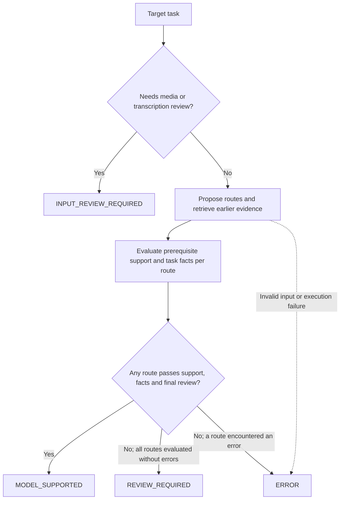

# MathemaTest

### Evidence-based auditing of mathematical and scientific learning material

**Does a textbook teach what a learner needs before asking them to use it?**

MathemaTest investigates this question by connecting a task's prerequisites to earlier instructional passages and explicitly stated learner knowledge. It produces an inspectable audit of the evidence, missing information and unresolved concerns behind a model's judgment.

The project combines language-model reasoning with source-order constraints, structured output validation and targeted mathematical checks. It is a research prototype built around existing models, rather than a separately trained foundation model.

[Quick start](#quick-start) · [Architecture](#system-architecture) · [Results](#recorded-results) · [Repository guide](#repository-guide)

## What it does

- **Preserves source context.** Prepare ordered textbook records from structured OpenStax sources; separate PDF tooling supports native text extraction and formula inspection.
- **Identifies prerequisites by solution route.** Propose up to two routes and distinguish necessary operations, domain rules and concepts from optional checks.
- **Retrieves eligible teaching.** Search earlier instructional material from the same source, excluding later passages and exercise material under the eligibility rules.
- **Connects claims to evidence.** Record source IDs, exact quotations and support witnesses explaining how the cited material supports a requirement.
- **Separates two kinds of missing information.** An absent formula or rule differs from a missing numerical value in the question.
- **Keeps an audit trail.** Save model calls, intermediate decisions, source hashes, usage records and final outcomes for inspection.

## A concrete example

Consider a task asking for the density of a sample. Assume the learner knows arithmetic but has no unstated knowledge of density.

| Earlier teaching and task information | What the audit should distinguish |
|---|---|
| The earlier lesson gives density = mass / volume; the task supplies both values. | The task may be supported if its prerequisites and final review pass. |
| The task supplies mass and volume, but the earlier lesson only names density without defining it. | The required domain rule has not been established. |
| The lesson gives the formula, but the task omits volume. | A task-specific fact is missing. |

These are illustrative expectations. A `REVIEW_REQUIRED` result flags a concern for inspection; it does not establish that the textbook contains a pedagogical gap.

## System architecture

The repository contains two audit paths. The current API control runner uses the **evidence-v2 curriculum path**. The graph and numerical path is a separate implementation with its own runners and infrastructure.

```mermaid
flowchart TB
    subgraph current["Current curriculum audit: evidence-v2"]
        A["Ordered source records + target task + learner background"]
        B["Source and input eligibility checks"]
        C["LLM: propose solution routes and prerequisites"]
        D["TF-IDF: retrieve eligible earlier passages"]
        E["Build evidence catalog and prerequisite support witnesses"]
        F["Check exact task readings and required task facts"]
        G["LLM: final review of a supported route"]
        H["Structured audit result and intermediate records"]
        A --> B --> C --> D --> E --> F
        F -->|"Prerequisites supported and facts sufficient"| G
        F -->|"Unresolved prerequisites or task facts"| H
        G --> H
    end
    subgraph separate["Separate graph and numerical audit path"]
        P["PDF text and source passages"]
        Q["Grounded extraction and source metadata"]
        R["Chroma vector retrieval + Neo4j graph retrieval"]
        S["Source, quantity and relation guards"]
        T["Bounded rational arithmetic checks"]
        P --> Q --> R --> S --> T
    end
```



The current curriculum path does not call Neo4j or Lean. Its support witnesses have mechanically checked structure and source references, but their general semantic correctness still depends on model judgments. The repository's separate Lean-related components do not make every audit a formal proof.

### How an outcome is reached



| Outcome | Meaning |
|---|---|
| `MODEL_SUPPORTED` | At least one proposed route passed the configured evidence, task-fact and final-review checks. This is a provisional model judgment. |
| `REVIEW_REQUIRED` | No evaluated route established support without unresolved concerns. Inspect the blocking stages and rationales. |
| `INPUT_REVIEW_REQUIRED` | The target depends on media or mathematical transcription that requires inspection. |
| `ERROR` | Input validation, provider execution or an output contract failed. This is not an educational judgment. |

These labels describe the current `evidence-v2` path. Historical runners also retain their own statuses, such as `INTERRUPTED` and `INVALID_EVIDENCE`.

## Quick start

### 1. Install the tested Python environment

Python **3.12** was used for the recorded local regression run. The commands below use a POSIX shell on macOS or Linux.

```bash
git clone https://github.com/neil-ravat/MathemaTest.git
cd MathemaTest
python3.12 -m venv .venv
source .venv/bin/activate
python -m pip install -r requirements-local.lock.txt
```

The lock file records the tested environment. Optional OCR and model components declared in `pyproject.toml` are not needed for the offline regression checks.

### 2. Run the offline checks

```bash
python -m pytest -q
```

Recorded result for the published code: **533 passed, 9 skipped**. This measures software regression checks, not textbook detection accuracy. No API credentials, GPU or running database services are needed for this suite. Some integration checks require separately obtained source PDFs or other local prerequisites and are skipped when unavailable.

### 3. Prepare an audit experiment without calling a model

```bash
python scripts/run_gpt4o_smoke.py \
  --provider groq \
  --suite development \
  --output artifacts/readme_demo_prepared
```

Despite its historical filename, this runner supports both OpenAI and Groq. Without `--run`, it only creates a manifest containing the development cases and a snapshot of the source code. No API key or GPU is required. Use a new output directory for each invocation; the runner refuses to overwrite an existing run.

### 4. Optionally run the development controls through an API

Create an ignored `.env` file in the repository root and set `GROQ_API_KEY` there. Then run:

```bash
python scripts/run_gpt4o_smoke.py \
  --provider groq \
  --suite development \
  --output artifacts/my_groq_development_run \
  --run
```

This makes real API calls and requires an account with available quota. The runner currently selects `openai/gpt-oss-120b` for Groq. Its OpenAI option selects `gpt-4o-mini-2024-07-18`, reads `OPENAI_API_KEY`, and additionally requires a positive `--budget-usd`. These are identifiers configured in the code, not a guarantee of current provider availability or free access. Keep credentials out of tracked files.

A live run writes:

| File | Contents |
|---|---|
| `manifest.json` | Cases, model configuration, workflow scope and source hashes |
| `<case-id>.json` | Intermediate evidence, model calls, route decisions and final status |
| `usage.json` | Provider requests, reported usage and applicable budget accounting |
| `summary.json` | Attempted cases and outcomes; no independent accuracy estimate |
| `source_snapshot/` | Code used for the run |

For the separate local Ollama curriculum runner, inspect `python scripts/run_curriculum_audit.py --help`. It consumes a JSONL corpus, target IDs and explicit learner background, and currently uses `qwen2.5-coder:7b` with `mistral:latest`. That runner uses the older curriculum protocol; its results should not be treated as interchangeable with `evidence-v2`.

## Recorded results

The repository includes inspectable development outputs. Read each run's manifest and evaluation together: versions, case selection and evaluation scope differ.

| Evidence | Recorded result | Interpretation |
|---|---|---|
| Local regression suite | **533 passed, 9 skipped** | Checks implementation behavior, not educational accuracy. |
| [Nine development controls](artifacts/groq_development_revision_20261001_01/evaluation.json) | **9/9 expected final statuses**; 3 supported and 6 review outcomes | Inspected synthetic controls. Some rationales remained incorrect despite matching statuses. An always-review rule would match 6/9. |
| [Five task-category regression checks](artifacts/groq_fact_taxonomy_validation_20261001_02/evaluation.json) | **5/5 task-category and final-status matches** | Reran task-fact checks and one final review using saved upstream outputs; not a fresh end-to-end evaluation. |
| [Frozen comparison](artifacts/six_improvements_20261001/fresh_comparison/summary.json) | **4 error outcomes, 8 unattempted arms, 0 valid final judgments** | Incomplete experiment; no comparative accuracy conclusion. |

Other retained runs include the [book pilot](artifacts/book_pilot/), [Groq transfer attempts](artifacts/groq_book_transfer_20261001_01/), [T4 continuation](artifacts/gpu20b_book_transfer_20261001_01/) and [extraction improvements](artifacts/six_improvements_20261001/post_inspection_extraction/). Opening these files does not resume inference.

### What remains to be established

- General pedagogical detection accuracy on fresh cases with independent expert labels.
- Whether graph-assisted retrieval improves performance under fair baseline and ablation conditions.
- Reliability across textbooks, notation, diagrams and learner backgrounds.
- End-to-end accuracy, uncertainty and cost under a frozen evaluation protocol.

Assistant-reviewed labels and same-model review are not independent validation. The raw evidence behind the original 30-case/503-item headline results was not recovered; those claims are not reconstructed from model outputs here.

## Repository guide

| Location | Purpose |
|---|---|
| [`src/verification/evidence_audit.py`](src/verification/evidence_audit.py) | Current route-based curriculum audit |
| [`src/verification/curriculum_audit.py`](src/verification/curriculum_audit.py) | Source eligibility, TF-IDF retrieval, evidence contracts and older audit flow |
| [`src/verification/primitive_skills.py`](src/verification/primitive_skills.py) | Explicit support for selected basic operations |
| [`src/ingestion/`](src/ingestion/) | Text, layout, formula and source-quality utilities |
| [`src/retrieval/`](src/retrieval/), [`src/graph_store/`](src/graph_store/), [`src/vector_store/`](src/vector_store/) | Separate graph/vector retrieval components |
| [`scripts/`](scripts/) | Corpus preparation, experiment runners, replays and evaluation tools |
| [`tests/`](tests/) | Regression tests and development fixtures |
| [`data/`](data/) | Constructed controls, selected NCERT inputs and pinned OpenStax records |
| [`artifacts/`](artifacts/) | Preserved experiment inputs, outputs and code snapshots |
| [`artifacts/release_manifest.json`](artifacts/release_manifest.json) | Published code/data file hashes and release scope |
| [`mathematest/`](mathematest/) | Lean project and related formalization work |

Historical artifacts preserve their original bytes and may contain absolute local paths. Use the corresponding repository-relative files when inspecting them. Snapshot hashes describe the original executions, not a new run of the latest code. The release manifest covers the published subset; it does not imply that every historical local file is available.

## Data attribution and publication scope

OpenStax source revisions, URLs and licenses are retained with the source records. The [Calculus source](data/openstax_calculus_v1/source/) is accompanied by a manifest specifying **CC BY-NC-SA 4.0**; the [Physics source license](artifacts/six_improvements_20261001/physics_source/source/LICENSE) specifies **CC BY 4.0**. These data terms are separate from the code's MIT designation in `pyproject.toml`.

NCERT inputs are attributed development excerpts; original source PDFs are not distributed in this update. Manuscripts, Word/PDF/LaTeX submission files, credentials, private databases, model weights and local environments remain excluded.
